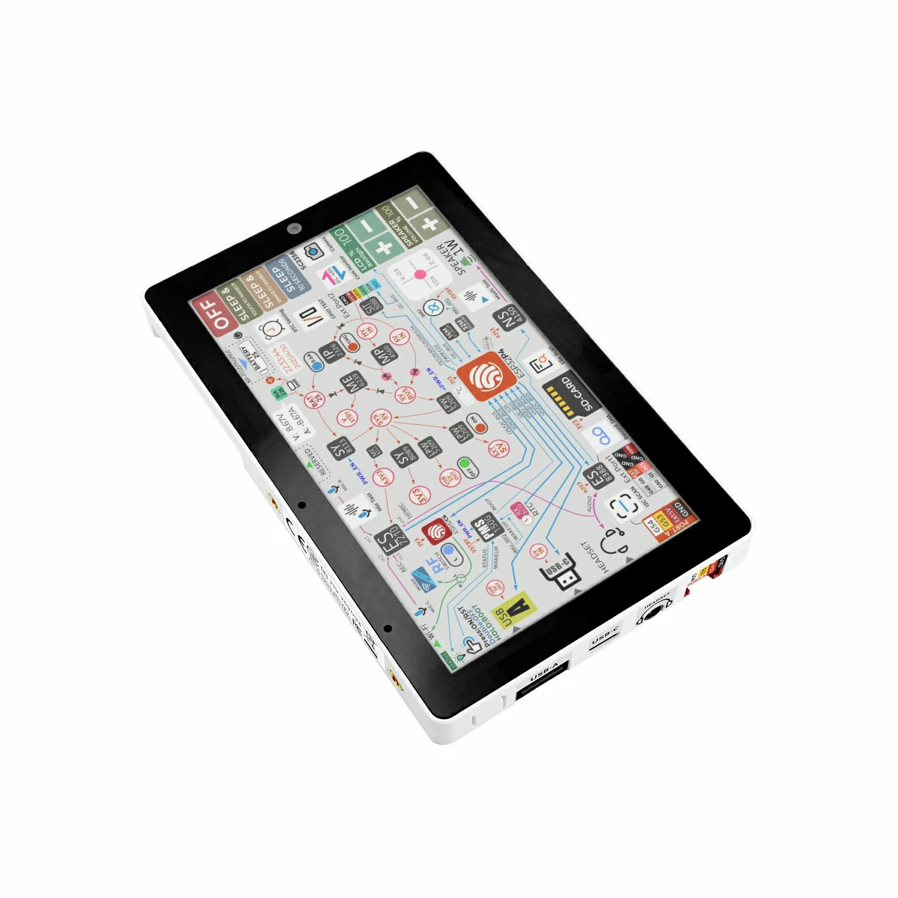

# 🎮 M5Stack Tab5 Fun Dev Kit
<p align="center">
  
</p>

> ✨ A collection of fun applications for the M5Stack Tab5 high-performance touch dev board powered by ESP32-P4 - turn your Tab5 into a multi-functional entertainment device in minutes!

---

## 📦 Project Overview

This repository contains two awesome M5Stack Tab5 applications built with the LVGL graphics library, ready to flash and play:

| 🎮 Game Project | 💻 Terminal Project |
|-----------------|---------------------|
| Neon Tetris Game | Smart Interactive Terminal |
| Touch gesture controls | Wi-Fi connectivity support |
| Smooth animation effects | Cool boot animation |
| Complete game logic | Extensible feature interface |

---

## 🕹️ Project 1: NEON Tetris
<p align="center">
  
</p>

### ✨ Features
- 🎨 **Neon Glow UI**: Cyberpunk aesthetic game interface
- 🖐️ **Touch Gesture Controls**: Swipe left/right to move, tap to rotate, swipe down to speed up
- 🎯 **Full Game Logic**: Line clearing, scoring, level progression system
- ⚡ **High Performance Rendering**: Smooth 60fps gameplay powered by ESP32-P4 + LVGL
- 🔊 **Audio Support**: (Extensible) Game sound effects and background music

### 📂 Code Structure
```
Game/
├── main/
│   ├── tetris_engine.c    # Core Tetris game logic
│   ├── tetris_view.c      # UI rendering
│   ├── game_controller.c  # Game control logic
│   ├── input_uart.c       # Input handling
│   └── ui_*.c             # Various UI components
├── sdkconfig              # Build configuration
└── CMakeLists.txt         # Project configuration
```

---

## 🖥️ Project 2: Smart Interactive Terminal
<p align="center">
  
</p>

### ✨ Features
- 🎬 **Cool Boot Animation**: Smooth SVG loading effects
- 🛜 **Wi-Fi Connectivity**: Built-in wireless management module
- 📱 **Touch Interaction**: Multi-touch and gesture recognition support
- 🔌 **Extensible Interfaces**: Plenty of reserved slots for feature expansion
- 🎨 **LVGL Component Library**: Rapid UI development with pre-built components

### 📂 Code Structure
```
Terminal/
├── main/
│   ├── example_lvgl_demo_ui.c  # Demo UI components
│   ├── wireless_mgr.c          # Wireless management
│   └── uart_mgr.c              # UART management
├── wifi_c6_fw/             # Wi-Fi firmware
├── svg-spinners/           # SVG animation assets
└── CMakeLists.txt          # Project configuration
```

---

## 🚀 Quick Start

### Hardware Requirements
- 🛠️ M5Stack Tab5 development board
- 🔌 USB-C data cable
- 💻 Computer (Windows/macOS/Linux)

### Environment Setup
1. Install [VS Code](https://code.visualstudio.com/)
2. Install [ESP-IDF Extension](https://marketplace.visualstudio.com/items?itemName=espressif.esp-idf-extension)
3. Clone this repository to your local machine

### Build & Flash
1. Open the project folder you want to use (Game or Terminal)
2. Connect your M5Stack Tab5 to your computer
3. Click the "⚡ Flash" button in the VS Code status bar
4. Wait for flashing to complete, the device will restart automatically

---

## 🎯 How to Play

### Tetris Controls
- 👈 Swipe Left: Move block left
- 👉 Swipe Right: Move block right
- 👇 Swipe Down: Speed up block falling
- 👆 Tap Screen: Rotate block
- 🏆 Clear more lines for higher scores, speed increases with level

### Terminal Features
- 🔄 Automatic boot animation on startup
- 📶 Auto-connects to Wi-Fi (configurable)
- 🖐️ Touch screen for interaction testing
- 🔧 Extensible for all kinds of smart applications

---

## 🛠️ Custom Development

### How to customize Tetris skins?
Edit the color macros in `Game/main/tetris_view.c` to customize block colors and interface styles!

### How to add new features to the terminal?
Add LVGL components in `Terminal/main/example_lvgl_demo_ui.c` - LVGL has tons of beautiful pre-built components you can use directly.

### Custom GIF Guide
Replace the demo GIFs above with your own actual screen recordings, place them in the `docs/` folder, and update the image links in this README.

---

## 📝 Tech Stack
| Technology | Purpose |
|------------|---------|
| ESP-IDF v5.x | IoT Development Framework |
| LVGL v9.x | Embedded Graphics Library |
| ESP-BSP | Board Support Package |
| C Language | Primary Development Language |
| CMake | Build System |

---

## 🤝 Contributing
Issues and PRs are welcome! Feel free to discuss any cool ideas you have for the project.

---

## 📄 License
This project is open source under the CC0-1.0 license - feel free to use and modify however you want!

---
<p align="center">
  Made with ❤️ for M5Stack Tab5
</p>