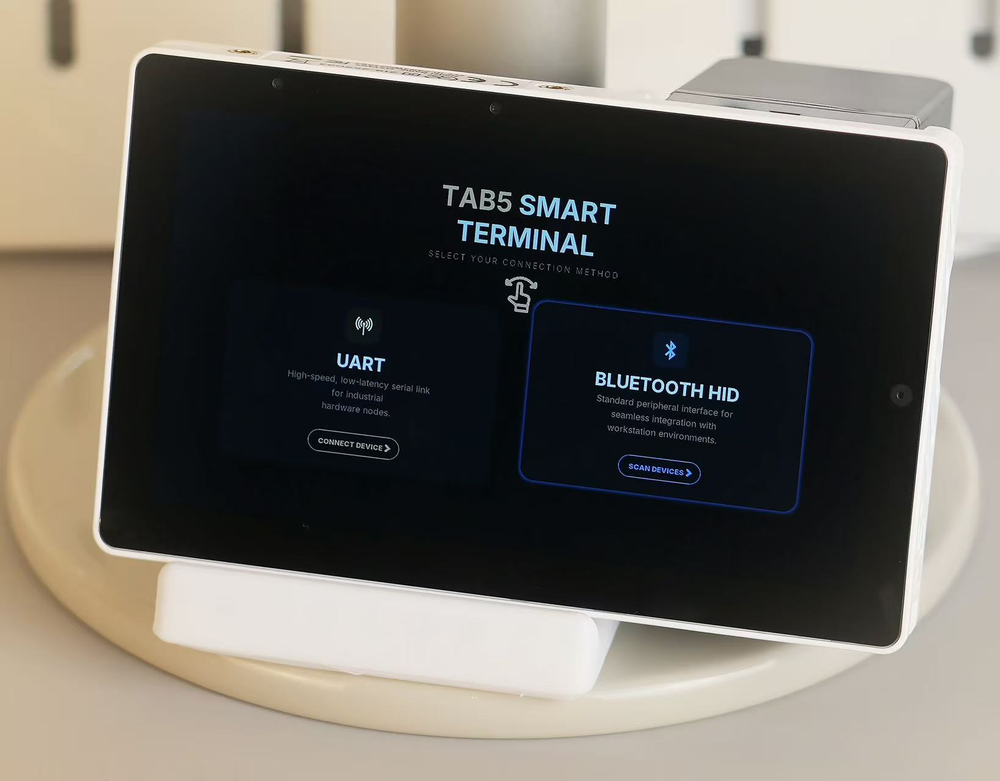
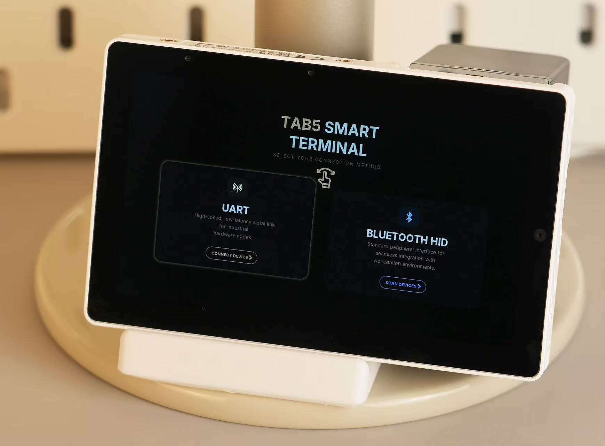
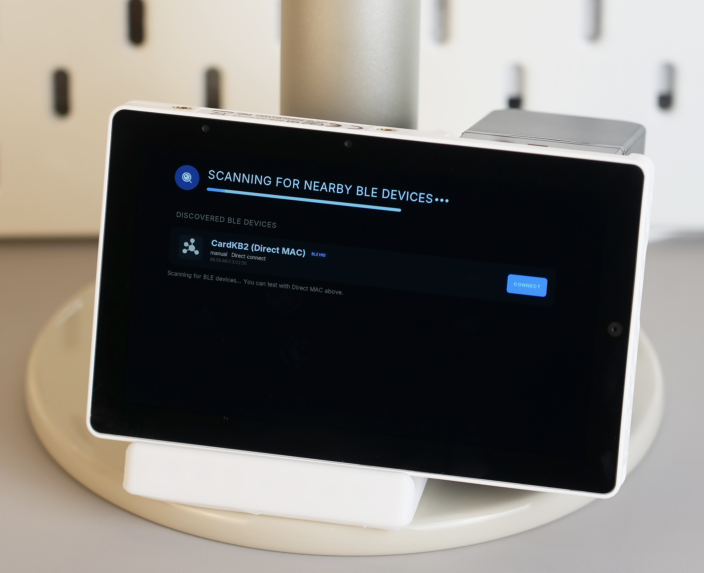
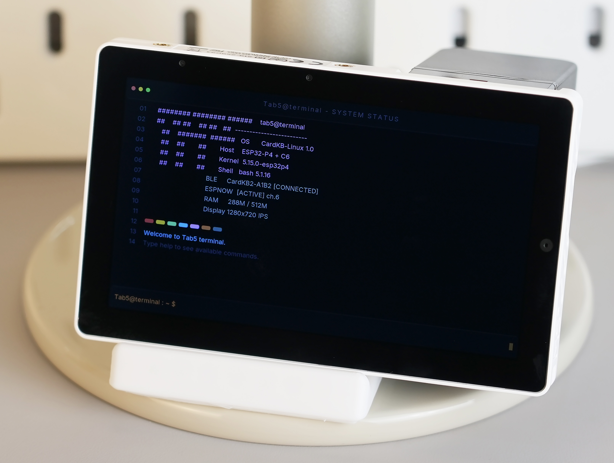
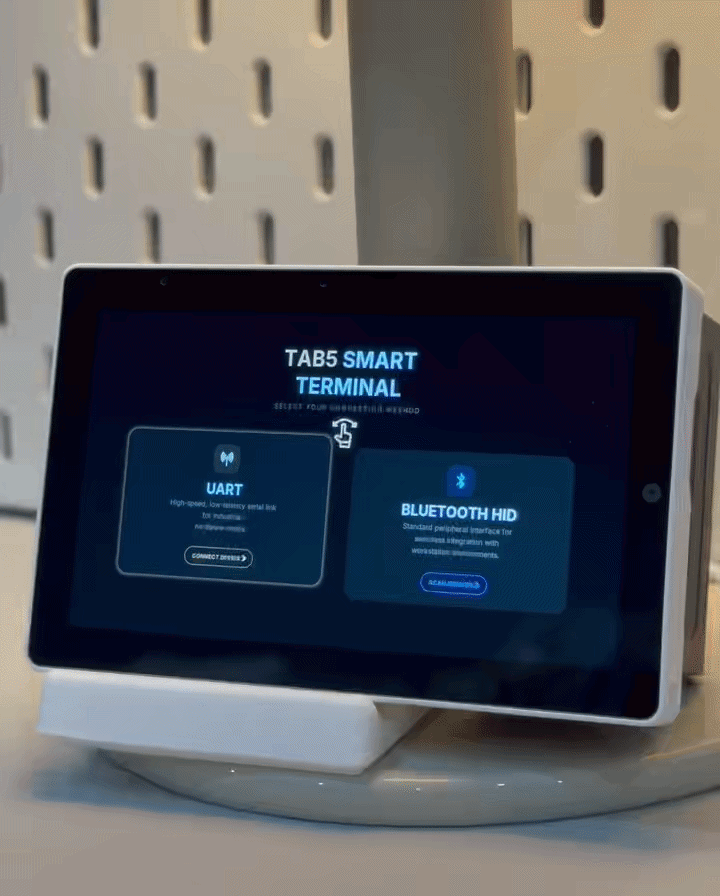

# Tab5 Terminal Demo

**A hacker-style terminal UI for the M5Stack Tab5**

*Plug in a keyboard. Type commands. Feel like you own the system.*

<br/>

[](https://docs.espressif.com/projects/esp-idf/en/latest/)
[](https://lvgl.io/)
[](https://www.espressif.com/en/products/socs/esp32-p4)
[](LICENSE)

<br/>

> 📺 **Watch the demo →** [bilibili.com/video/BV1Gc9NBiEnC](https://www.bilibili.com/video/BV1Gc9NBiEnC/?spm_id_from=333.337.search-card.all.click&vd_source=8dac32984926ea536404e89c4dd4f963)

</div>

---

## 🎬 Preview

</div>

<br/>

<table>
  <tr>
    <td align="center" width="49%">
      <br/>
      <sub>🏠 Home — select connection method</sub>
    </td>
    <td align="center" width="51%">
      <br/>
      <sub>🏠 Home — UART card selected</sub>
    </td>
  </tr>
  <tr>
    <td align="center" width="49%">
      <br/>
      <sub>🔍 Scan — discovering nearby BLE devices</sub>
    </td>
    <td align="center" width="51%">
      <br/>
      <sub>💻 Terminal — neofetch system info</sub>
    </td>
  </tr>
</table>

<div align="center">

</div>

---

## ✨ What is this?

A **terminal emulator UI** built with [LVGL v9](https://lvgl.io/) running on the [M5Stack Tab5](https://docs.m5stack.com/en/core/tab5) — a 5-inch 1280×720 IPS touchscreen device powered by the **ESP32-P4** (RISC-V dual-core @ 360MHz) and an **ESP32-C6** wireless coprocessor.

Connect a **CardKB2** keyboard over UART and you get a fully interactive retro-terminal: colored output, line numbers, scrollable history, command autocomplete — all on a palm-sized device.

```
Tab5@terminal : ~ $ neofetch

  ######## ######## ######    tab5@terminal
  ##    ## ##    ## ##   ##   ─────────────────────────
     ##    #######  ######    OS      CardKB-Linux 1.0
     ##    ##       ##        Host    ESP32-P4 + C6
     ##    ##       ##        Kernel  5.15.0-esp32p4
     ##    ##       ##        Shell   bash 5.1.16
                              BLE     CardKB2 [CONNECTED]
                              ESPNOW  [ACTIVE] ch.6
                              RAM     16MB Flash / 32MB PSRAM
                              Display 1280×720 IPS
```

---

## 🛠️ Hardware

<table>
  <tr>
    <td align="center">
      <br/>
      <sub><a href="https://docs.m5stack.com/en/core/Tab5">M5Stack Tab5</a> — ESP32-P4, 5" 1280×720 IPS</sub>
    </td>
  </tr>
</table>

| Component | Spec |
|-----------|------|
| **Main SoC** | ESP32-P4 · RISC-V dual-core 360 MHz + LP core 40 MHz |
| **Wireless** | ESP32-C6-MINI-1U · Wi-Fi 6 / BLE 5 / Thread / Zigbee |
| **Flash** | 16 MB |
| **PSRAM** | 32 MB |
| **Display** | 5-inch IPS TFT · 1280×720 (720p) · ST7123 TDDI |
| **Touch** | Capacitive · built-in to ST7123 |
| **Keyboard** | M5Stack CardKB2 · connected via **UART** |
| **UART pins** | TX → GPIO 53 / RX → GPIO 54 · 115200 baud · HY2.0-4P port |

> ⚠️ **Current Status**
>
> | Mode | Status |
> |------|--------|
> | **UART** (CardKB2 via HY2.0-4P) | ✅ Works |
> | **Bluetooth HID** (CardKB2 via BLE) | 🚧 UI Present — Not Functional Yet |

---

## 🚀 Getting Started

### Prerequisites

- [ESP-IDF v5.3+](https://docs.espressif.com/projects/esp-idf/en/latest/esp32p4/get-started/index.html)
- M5Stack Tab5 connected via USB-C

### Build & Flash

```bash
git clone <this-repo>
cd TerminalDemo

idf.py set-target esp32p4

idf.py -D SDKCONFIG_DEFAULTS="sdkconfig.defaults;sdkconfig.bsp.m5stack_tab5" build

idf.py -p /dev/ttyUSB0 flash monitor
```

### Wire the CardKB2

Connect the CardKB2 to Tab5's **HY2.0-4P (PORT.A)** socket:

```
CardKB2          HY2.0-4P (PORT.A)
  GND   ───────────── GND
  3.3V  ───────────── 5V
  TX    ───────────── G54  (UART RX)
  RX    ───────────── G53  (UART TX)
```

> 💡 On the home screen, tap the **UART** card once to select it, then tap again to enter the terminal directly.

---

## 📱 UI Flow

```
┌──────────────────────────────────────────────┐
│               🏠  Home Screen                │
│                                              │
│   ┌──────────────┐    ┌──────────────┐       │
│   │     UART     │    │ BLUETOOTH HID│       │
│   │  ✅ Working  │    │  🚧 WIP      │       │
│   └──────────────┘    └──────────────┘       │
└──────────────────────────────────────────────┘
         │ tap UART card twice
         ▼
┌──────────────────────────────────────────────┐
│               💻  Terminal                   │
│   Blinking cursor · colored output           │
│   Line numbers · scrollable · autocomplete   │
└──────────────────────────────────────────────┘

         (BLE path, WIP)
         │ tap BLUETOOTH HID → SCAN DEVICES
         ▼
┌──────────────────────────────────────────────┐
│               🔍  Scan Screen                 │
│   Live BLE discovery · RSSI · device name    │
└──────────────────────────────────────────────┘
         │ tap CONNECT
         ▼
┌──────────────────────────────────────────────┐
│          ⚡  Connecting...                   │
│          12-dot spinner animation            │
└──────────────────────────────────────────────┘
```

---

## ⌨️ Terminal Commands

Once in the terminal, the **CardKB2** input appears in the bottom bar with a blinking cursor. Press `Enter` to run.

### 🖥 System

| Command | Returns |
|---------|---------|
| `help` | All commands grouped by category |
| `clear` | Clear the screen |
| `neofetch` | Stylized system info banner |
| `uname -a` | `Linux tab5 5.15.0-esp32p4 #1 SMP PREEMPT` |
| `uptime` | Live uptime since boot |
| `date` | Current date/time |
| `pwd` | `/home/tab5` |
| `whoami` | `tab5` |

### 📁 Files

| Command | Returns |
|---------|---------|
| `ls` | `bin  etc  home  proc  tmp  usr` |
| `ls -la` | Detailed listing with permissions |
| `cat /etc/motd` | Message of the day |

### 🌐 Network

| Command | Returns |
|---------|---------|
| `ifconfig` | `wlan0` interface with IP/MAC |
| `ping` / `ping 8.8.8.8` | Animated 5-packet ping with RTT |
| `ble status` | BLE connection state |
| `espnow scan` | Simulated ESP-NOW node discovery |

### ⚙️ Process

| Command | Returns |
|---------|---------|
| `top` | Live FreeRTOS task table — CPU %, stack, name |
| `ps` | Process snapshot |

### 🎉 Fun

| Command | Returns |
|---------|---------|
| `fortune` | _"Any sufficiently advanced bug is indistinguishable from a feature."_ |
| `sudo` | `Sorry, try again.` × 3 |
| `sudo rm -rf /` | `Permission denied, phew.` |
| `reboot` | Fake reboot → neofetch splash |

### ⌨️ Keyboard Shortcuts

| Key | Action |
|-----|--------|
| `Enter` | Execute command |
| `Backspace` | Delete character |
| `↑` / `↓` | Command history (last 20) |
| `Tab` | Autocomplete from catalog |

---

## 📁 Project Structure

```
TerminalDemo/
├── main/
│   ├── main.c                  # Entry: BSP init → wireless → UI
│   ├── CMakeLists.txt
│   ├── wireless/
│   │   ├── wireless_mgr.c/h    # Shared node list, WiFi/BLE init
│   │   ├── ble_mgr.c           # NimBLE HID central (CardKB2 BLE)
│   │   ├── espnow_mgr.c        # ESP-NOW scan & receive
│   │   └── uart_mgr.c/h        # UART driver (CardKB2, GPIO53/54)
│   ├── ui/
│   │   ├── ui_common.h         # Colors, fonts, layout constants
│   │   ├── ui_home.c           # Home: UART / BT HID selection
│   │   ├── ui_scan.c           # BLE scan list
│   │   ├── ui_connect.c        # Connection spinner animation
│   │   ├── ui_connected.c      # Connected status page
│   │   └── ui_terminal.c       # Interactive terminal (500-line scrollback)
│   └── assets/
│       ├── fonts/              # Inter typeface — 14 weight/size variants
│       └── images/             # Icons: arrows, BT logo, ESP-NOW, etc.
├── readme/                     # Screenshots & demo GIF
├── sdkconfig.defaults
├── sdkconfig.bsp.m5stack_tab5
└── partitions.csv
```

---

## 🎨 Color Palette

| Swatch | Hex | Role |
|--------|-----|------|
| 🟧 | `#E07B39` | Prompt `Tab5@terminal : ~ $` |
| 🟨 | `#F0C27F` | User input |
| 🟦 | `#60A5FA` | Info / headings |
| 🟩 | `#4ADE80` | Success |
| 🟥 | `#F87171` | Error |
| 🟡 | `#FBBF24` | Warning |
| 🟣 | `#E879F9` | Highlight |
| ⬛ | `#0E0E11` | Background |

---

## 🔧 Customization

**Add a command** — in `main/ui/ui_terminal.c`:

```c
} else if (strcmp(start, "hello") == 0) {
    term_append_line(T_SUCCESS, "Hello, world!");
}
```

Add it to the autocomplete catalog at the top of the same file:

```c
static const char *s_cmd_catalog[] = {
    "help", "clear", ...,
    "hello",            // ← add here
};
```

**Change UART pins** — in `main/wireless/uart_mgr.h`:

```c
#define UART_KB_TX_PIN      53
#define UART_KB_RX_PIN      54
#define UART_KB_BAUD_RATE   115200
```

---

## 📄 License

CC0-1.0 — public domain. Do whatever you like.

---

<div align="center">

Built with ☕ on an ESP32-P4.

**[▶ Watch the full demo on Bilibili](https://www.bilibili.com/video/BV1Gc9NBiEnC/?spm_id_from=333.337.search-card.all.click&vd_source=8dac32984926ea536404e89c4dd4f963)**

</div>

